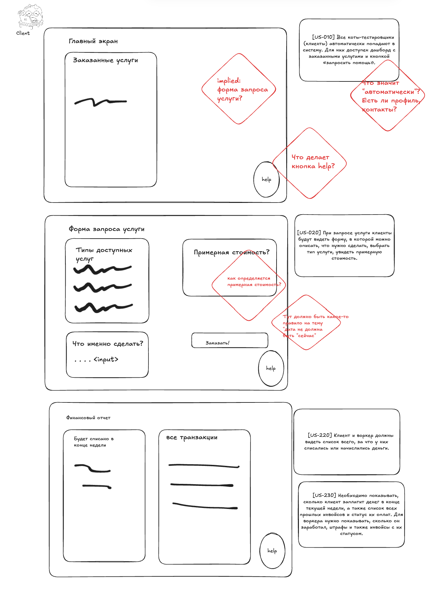

# Make Cats Free v.0

## Контекст

Решение призвано автоматизировать операции компании make cats free (MCF).
Детальный контекст и требования: https://lms.tough-dev.school/materials/978832265d2044b8b7b3f0ed9c89b53d

## Предположения (или вопросы к заданию):
- Решение разрабатывает одна команда, которая имеет все нужные для реализации компетенции

## Структура системы

Исходя из не-функциональных требований (ниже) предлагаю реализовать решение в виде монолитного приложения - это позволит упростить архитектуру (и инфраструктуру для) решения, сократить длительность итераций и сделать разработку проще, что особенно важно на этапе холодного старта проекта и для обеспечения низкого ТТМ и быстрой проверки гипотез. 

- Бизнесу необходим низкий ТТМ (Time To Market), чтобы конкурировать на рынке.
- Общая нагрузка на систему не будет превышать 10 заказов в день и 100 клиентов. Воркеров будет около 20 котов.
- Для бизнеса критично проверять новые гипотезы по отсеву котов и изменять уже существующие с максимальной скоростью и надёжностью.

Однако мы будем руководствоваться набором принципов при разработке архитектуры модулей и реализации решения, который позволят нам поддерживать высокий темп разработки и изменений и на более поздних этапах:

- Направление зависимостей: детали реализации (БД, UI, Framework) зависят от бизнес-логики, а не наоборот
- Inversion of Control: модули более высокого уровня не зависят от модулей более низкого уровня - и те и другие зависят от абстракций

### Верхнеуровневый дизайн

###  Компоненты решения:

#### Хранилище 
Работу с хранилищем организуем в виде абстрактного репозитория, которы не зависит от деталей реализации конкретного хранилища. 

Паттерны доступа не продумывал, поэтому могу сформулировать только общий подход к выбору хранилища - делаем все что можем, чтобы отложить выбор. Используем файловое/объектное хранилище + творческое партиционирование чтобы избежать скан. 

#### Модуль обработки заказа
Реализует работу с ключевой сущностью системы - Заказ, состояние которой порождает разнообразные операции и взаимодействия. 

Состояния Заказа:
- Создан
- Создан и назначено требуемое время выполнения
- Подобран инвентарь
- Воркер приступил к выполнению  [US-070]
- Выполнен
- Отменен
- Провален

Синхронно взаимодействует с 
- модулем расчета стоимости заказа, чтобы получить предварительную оценку стоимости 

Синхронно или через асинхронные коммуникации (Observer Pattern) взаимодействует с
- модулем мэтчинга для назначения воркера 
- (модуль подбора инвентаря) для заявка на подбор инвентаря  и получения коллбэка о том, что инвентарь готов 
- модулем нотификации для отправки уведомлений согласно требований
- модулем ставок для уведомления об успешном или нет завершении заказа

Реализует "Триггер"
- заказ провален (время выполнения заказа подошло, но воркер не приступил выполнению) [US-110]
    -> создается новый заказ [US-112]
    -> отправляются нотификации согласно требований

#### Модуль подбора инвентаря
- Вызывается (предпочтительно через нотификацию) модулем обработки заказа.  [US-130], [US-140]
- взаимодействует с внешним поставщиком услуг [US-150]
- Уведомляет модуль обработки заказа о том, что инвентарь для заказ собран. 

#### Модуль мэтчинга
- Подбирает исполнителя под заказ. Для начала рандомно.  [US-060]

#### Модуль рекрутмента воркеров
- реализует возможность оставить заявку "стать воркером" 
- механизм тестирования (и изменения тестов) [US-100] , [US-101] 
- добавления принятого воркера в пулл воркеров

#### Модуль качества:
- реализует форму оценки качества и соответствующие нотификации
- согласно [US-180] может быть реализован механизм анализа качества

#### Модуль биллига и оплаты труда
- взаимодействует с модулем расчета стоимости  заказа для высталвения счетов
- каждое воскресенье обрабатывает все выполненные, отмененные или проваленные заказы и формуирует инвойсы [US-190] , [US-030], [US-040], [US-111]
- в последний день месяца рассчитывает оплату воркеров [US-200], [US-210]и выполняет оплату через внешнюю Золотую Шляпу
- реализует право менеджера выдать премию воркеру [US-240] 

#### Модуль расчета стоимости заказа
- Рассчитывает стоимость заказа. Для начала всегда 100 котоединиц [US-050] 

#### Модуль внешних нотификаций
- реализует отправку внешних нотификаций от других модулей [US-270]-[US-276]
- я поленился раскидать конкретные уведомления по каждому модулю-источнику уведомления (((

#### Модуль качества
- реализует форму оценки качества [US-160], [US-170], [US-180]
- нотификации

#### Модуль ставок
- Реализует возможность делать ставки на заказы и автоматический расчет результатов ставок [US-250]-[US-262]

#### Клиент

Тут должны быть мокапы экранов, которые позволят разработчикам понять что происходит. Успел нарисовать не все - точно не хватает формы оценки качества, экрана со ставками...

