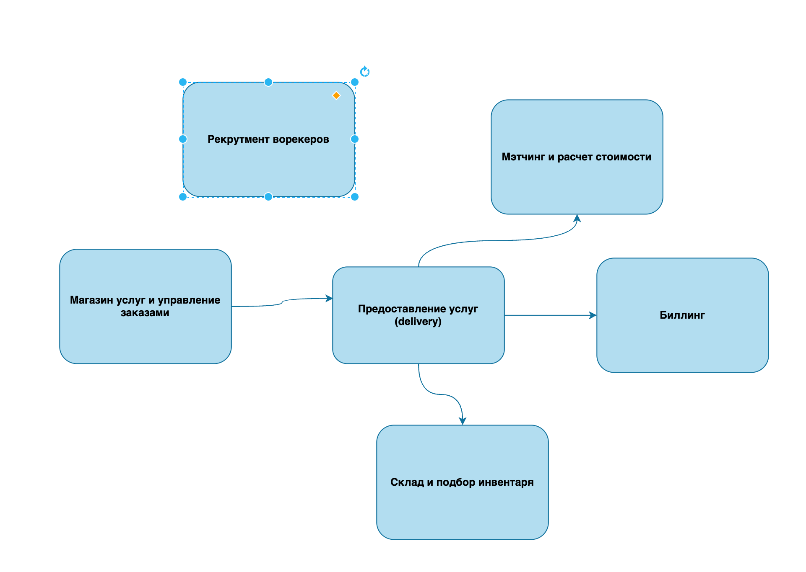

# Make Cats Free v.1

## Контекст

Решение призвано автоматизировать операции компании make cats free (MCF).
Детальный контекст и требования: https://lms.tough-dev.school/materials/978832265d2044b8b7b3f0ed9c89b53d

## Event Storming model

Предлагаю сгруппировать события и команды следующим образом:

1. Контекст "Магазин услуг и управление заказами" - включаем формирование каталога услуг и управление заказами
2. Контекст "Предоставление услуг" - включает формирование задач и контроль их выполнения
3. Мэтчинг и расчет стоимости: подбор воркера под заказ и формирование цены
4. Склад и подбор инвентаря: подбор инвентаря под заказ и клиента
5. Биллинг: формирование счетов и биллинг заказов и оплата труда воркеров
6. Рекрутмент воркеров: привлечение, тестирование и прием воркеров на работу

## Модель данных

## Общая модель коммуникаций в системе

## Архитектура проекта

Предлагаю реализовать микросервисную архитектуру, с асинхронными коммуникациями между сервисами.
Все контексты в системе достаточно независимы и не требуют синхронных вызовов между собой. Кроме того, часто контекстов
могут быть stateless, что делает их хорошими кандидатами для реализации в serverless архитектуре.

Аргументы в пользу микросервисной архитектуры:

- Независимость контекстов по поведению и данным
- Нет потребности в транзакционных операциях между контекстами
- Возможность масштабирования и развертывания отдельных сервисов
- Возможность параллельной разработки и тестирования
- Возможность использования различных технологий и языков программирования для реализации различных сервисов
- Сервис Рекрутмента имеет риск DDoS-атаки, что так же является аргументом для его изоляции
- Изоляция, независимость сервисов позволяет уменьшить влияние ошибок в одном сервисе на другие
    - Контекст "Предоставление услуг" имеет зависимости от "Мэтчинга" и "Склада", но в случае их недоступности может
      продолжать работу с частично деградацией, например, откладывая заказы в очередь.

Аргументы против микросервисной архитектуры:

- Сложность развертывания и управления
- Сложность интеграции и тестирования
- Стоимость инфраструктуры и поддержки
- Повышенные требования к мониторингу, логированию и трейсингу
- Повышенные требования к навыкам разработчиков

На мой взгляд при кажущейся простоте и более низкой стоимости монолитной архитектуры (которую я выбрал в нулевой
домашке), плюсы независимой разработки, большей простоты каждого отдельного сервиса и отказоустойчивости перевешивают.

## Спорные места

...и проблемы, над которыми я бы еще подумал, если бы было время.

1. Я объединил контексты Мэтчинга и определения стоимости в один как упрощение, нарушая принцип единой ответственности.
   Кроме того, не до конца понятна бизнес-причина определения стоимости после мэтчинга ([US-050]).
   Тут требуется уточнение требований: Возможно определение стоимости может быть частью Биллинг-контекста, отдельным
   контекстом реализованным, вероятно, в отдельном сервисе.

2. Все сервисы зависят (читают) профиль пользователя (или какие-то его части).
    3. Предвижу проблемы асинхронной стримминг коммуникации: случилось событие, а профиль еще недоступен.
       Нужно обрабатывать такие кейсы.
