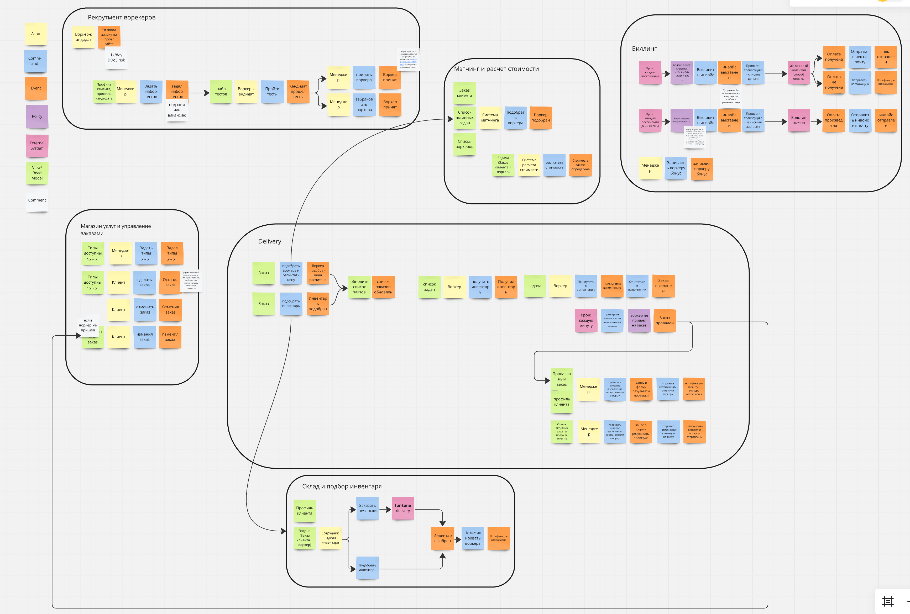
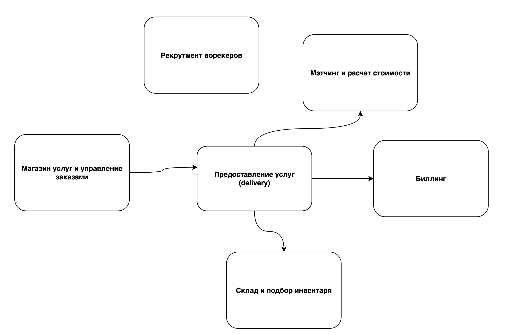
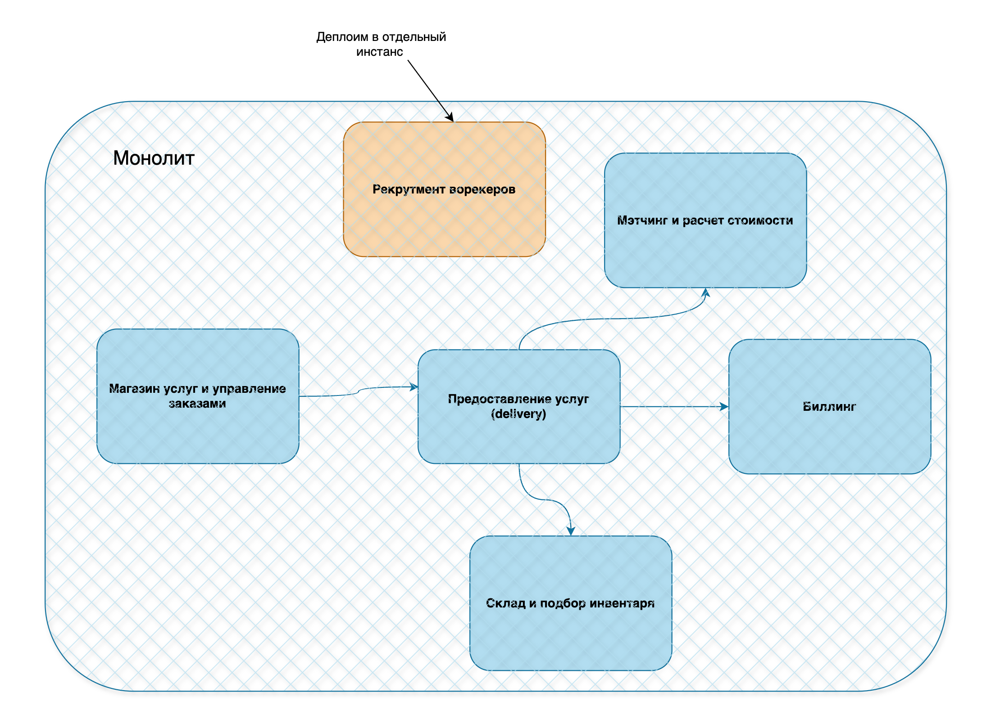

# Make Cats Free v.1

## Контекст

Решение призвано автоматизировать операции компании make cats free (MCF).
Детальный контекст и требования: https://lms.tough-dev.school/materials/978832265d2044b8b7b3f0ed9c89b53d

## Event Storming model

Предлагаю сгруппировать события и команды следующим образом:

1. Контекст "Магазин услуг и управление заказами" - включаем формирование каталога услуг и управление заказами
2. Контекст "Предоставление услуг" - включает формирование задач и контроль их выполнения
3. Мэтчинг и расчет стоимости: подбор воркера под заказ и формирование цены
4. Склад и подбор инвентаря: подбор инвентаря под заказ и клиента
5. Биллинг: формирование счетов и биллинг заказов и оплата труда воркеров
6. Рекрутмент воркеров: привлечение, тестирование и прием воркеров на работу

## Модель данных

## Общая модель коммуникаций в системе

## Архитектура проекта

Рассмотрев приведенные ниже аргументы в пользу монолитной и микросервисной архитектур, предлагаю реализовать монолитную,
преимущественно с асинхронными коммуникациями между модулями через коллбэки или таски.
С моей точки зрения, низкая стоимость входа и простота разработки для green-field проекта, при аккуратном менеджименте
зависимостей перевешивают преимущества микросервисной архитектуры.

Поскольку модуль "Рекрутмента воркеров" подвержен риску
ДДоС-атак, предлагаю деплоить его из той же кодовой базы в отдельный сервис. Кроме того, контекст, который реализует
этот модуль не связан событиями с другими контекстами, что позволяет его изолировать и исключить влияние его
недоступности на работу других контекстов.

Аргументы в пользу монолитной архитектуры:

- Простота и низкая стоимость развертывания и управления
- Простота и скорость разработки для green-field проекта
- Простота интеграции и тестирования
- Возможность масштабирования через развертывание отдельных модулей в отдельных сервисах
- Простота мониторинга, логирования и трейсинга
- Все контексты приложения зависят от рид-модели "Клиент" (или каких-то ее подмножеств) - в монолитной архитектуре будет
  особенно просто реализовать ее через общий доступ к БД.

Аргументы в пользу микросервисной архитектуры:

- Независимость контекстов по поведению и данным
- В приложении нет потребности в транзакционных операциях между контекстами, что упрощает асинхронную коммуникацию
- Возможность масштабирования и развертывания отдельных сервисов
- Возможность параллельной разработки и тестирования
- Возможность использования различных технологий и языков программирования для реализации различных сервисов
- Изоляция, независимость сервисов позволяет уменьшить влияние ошибок в одном сервисе на другие
    - Контекст "Предоставление услуг" имеет зависимости от "Мэтчинга" и "Склада", но в случае их недоступности может
      продолжать работу с частично деградацией, например, откладывая заказы в очередь.

В любом случае, мы будем руководствоваться набором принципов при разработке архитектуры модулей и реализации решения,
который позволят нам поддерживать высокий темп разработки и изменений и на более поздних этапах:

- Направление зависимостей: детали реализации (БД, UI, Framework) зависят от бизнес-логики, а не наоборот
- Inversion of Control: модули более высокого уровня не зависят от модулей более низкого уровня - и те и другие зависят
  от абстракций
- Контроль связности: запрет на зависимости между модулями реализующими разные контексты: взаимодействие через
  абстракцию с коллбэками или через таски (например Python фреймворк TaskIQ)

## Спорные места

...и проблемы, над которыми я бы еще подумал, если бы было время.

1. Я объединил контексты Мэтчинга и определения стоимости в один как упрощение, нарушая принцип единой ответственности.
   Кроме того, не до конца понятна бизнес-причина определения стоимости после мэтчинга ([US-050]).
   Тут требуется уточнение требований: Возможно определение стоимости может быть частью Биллинг-контекста, отдельным
   контекстом реализованным, вероятно, в отдельном сервисе.

2. Контекст и сервис "Деливери" перегружены бизнес логикой. Возможно имеет смысл выделить контекст "Задача", который 
   будет отвечать за список задач и коммуницировать с "Деливери" через доменное событие "Задача готова к выполнению".

3. Все сервисы зависят (читают) профиль пользователя (или какие-то его части).
    1. Предвижу проблемы асинхронной стримминг коммуникации: случилось событие, а профиль еще недоступен. В рамках
       монолита решается общим доступом к БД. При дальнейшей эволюции системы, вероятно придется выделить сервис профиля
       чтобы получить профиль из него в случае если он не доступен в кэше профиля через стриминг.
