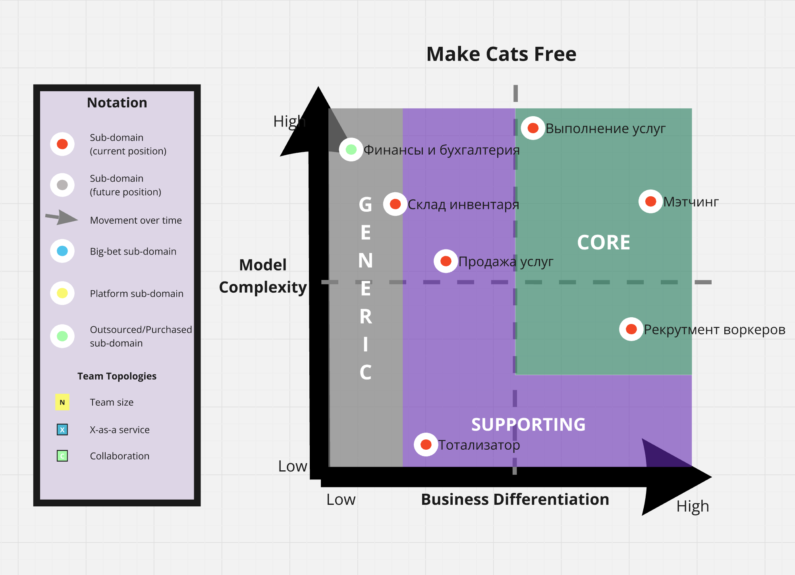
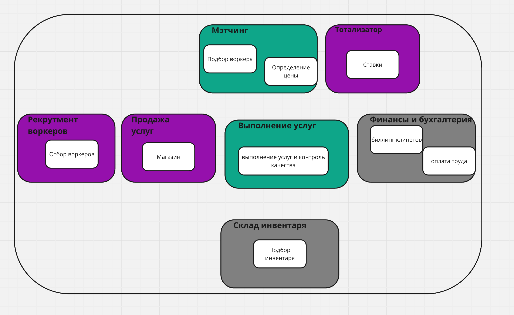
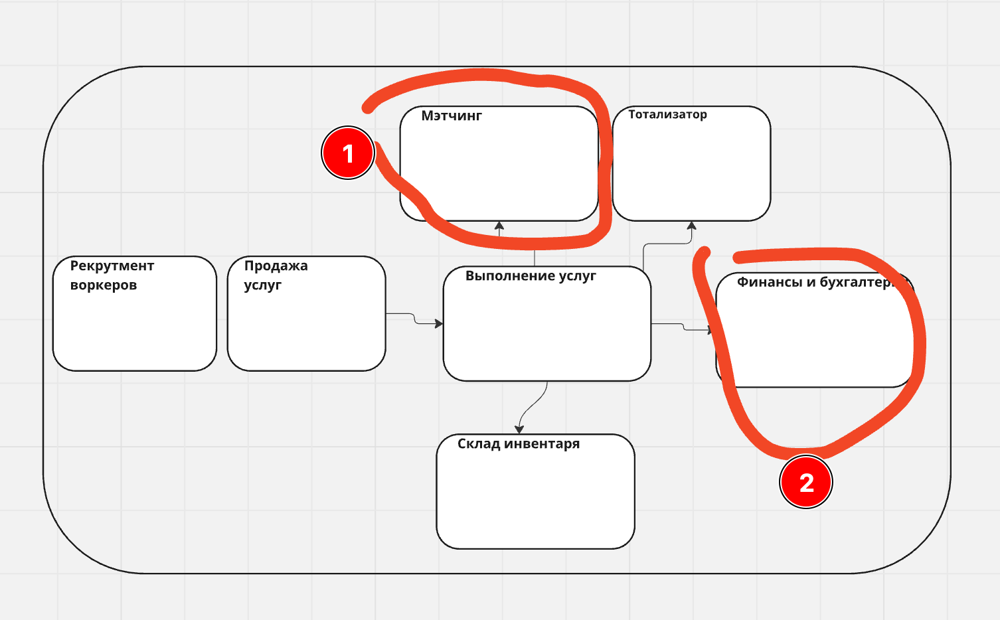
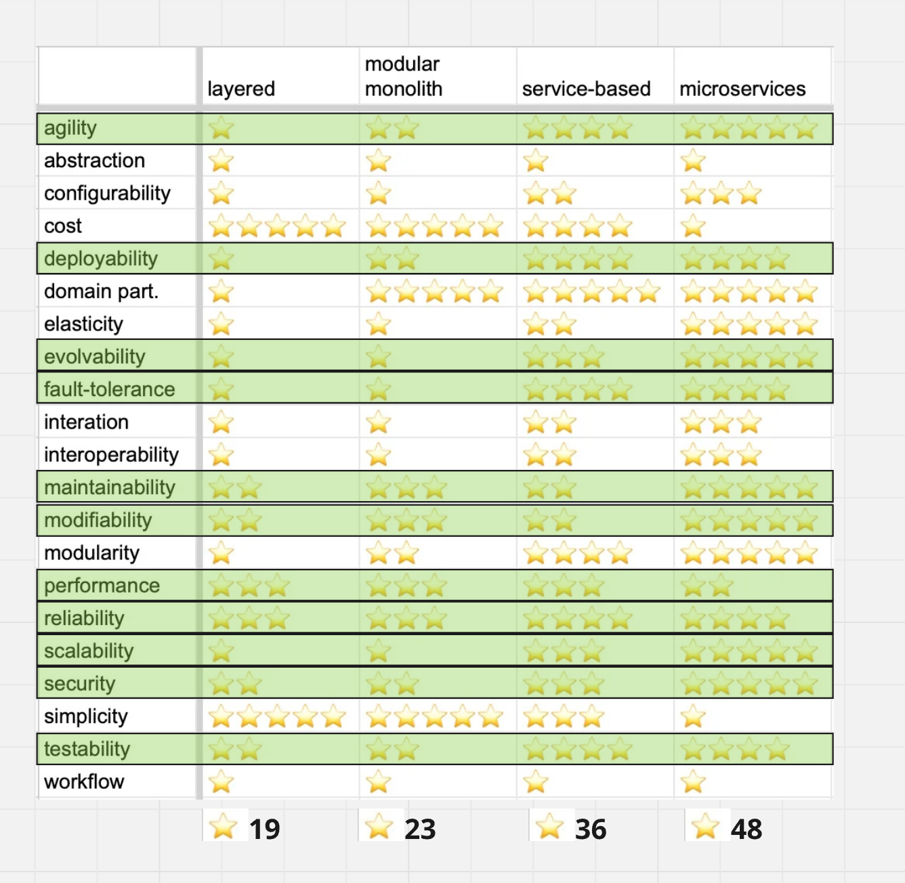

# Разбиваем систему на элементы

## Business domain

MCF решает проблему усталости и снижения производительности труда котов-тестировщиков за счет делегирования их рутинных домашних задач

## Sub-domains

| Вид поддомена               | Конкурентное преимущество | Сложность доменной модели | Изменчивость | Варианты реализации              | Интерес проблемы | Предполагаемый вид поддомена |
| --------------------------- | ------------------------- | ------------------------- | ------------ | -------------------------------- | ---------------- | ---------------------------- |
| Рекрутмент воркеров         | нет                       | средняя                   | частая       | in house, купить готовое решение | средний          | core                         |
| Продажа услуг               | нет                       | высокая                   | редкая       | in house, купить готовое решение | низкий           | supporting                   |
| Выполнение услуг (delivery) | нет                       | высокая                   | редкая       | in house                         | низкий           | core                         |
| Мэтчинг                     | да                        | высокая                   | частая       | ?                                | высокий          | core                         |
| Склад инвентаря             | нет                       | высокая                   | редкая       | in house, купить готовое решение | низкий           | supporting                   |
| Финансы и бухгалтерия       | нет                       | высокая                   | редкая       | in house, купить готовое решение | низкий           | generic                      |
| Тотализатор                 | нет                       | низкая                    | редкая       | in house                         | низкий           | supporting                   |

## Bound contexts

|                             |                              |                                               |
| --------------------------- | ---------------------------- | --------------------------------------------- |
| Вид поддомена               | Предполагаемый вид поддомена | Выделенный боундед-контекст                   |
| Рекрутмент воркеров         | core                         | Отбор воркеров                                |
| Продажа услуг               | supporting                   | Магазин                                       |
| Выполнение услуг (delivery) | core                         | Выполнение услуг и контроль качества          |
| Мэтчинг                     | core                         | Подбор воркеров под клиента, определение цены |
| Склад инвентаря             | supporting                   | Слад и подбор инвентаря                       |
| Финансы и бухгалтерия       | generic                      | Billing&collection, worker compensation       |
| Тотализатор                 | supporting                   | Ставки                                        |

Отличие от ES модели:

В целом у меня не вышло большой разницы в контекстах между ES и Доменной моделью (вероятно, я что-то не понял 🤷). Заметил что:
1. в поддомене Мэтчинг живут 2 баундед-контекста: подбор воркера под заказ и определение цены
2. В бухгалтерии 2 разных контекста: биллинг клиентов и компенсация воркерам

ЗЫ: контекст "Определение цены" держу вместе с мэтчингом, потому что у них причинная связь и из требований так и не стало яснее какие связи у определения цены, чтобы можно было этот контекст переместить или изолировать. 

# Определяем характеристики

|         | Описание/драйвер                                                                                                                                                                        | Характеристики                                                                                                                   |
| ------- | --------------------------------------------------------------------------------------------------------------------------------------------------------------------------------------- | -------------------------------------------------------------------------------------------------------------------------------- |
| Явные   |                                                                                                                                                                                         |                                                                                                                                  |
|         | низкий TTM (надо конкретизировать)                                                                                                                                                      |                                                                                                                                  |
|         | Нагрузка - 10 заказов в день - 100 клиентов - 20 воркеров                                                                                                                      |                                                                                                                                  |
|         | **Модуль рекрутмента воркеров** - Максимально быстро проверять гипотезы по отсеву котов  - Максимально быстро и надежно менять существующие гипотезы - 1000 DAU - Риск DDoS | - Agility - Testability - Deployability - Modifiability - Scalability - Securability - Availability            |
|         |                                                                                                                                                                                         |                                                                                                                                  |
| Скрытые | **Магазин услуг и сервис упралвения delivery:** как минимум 2 флоу оценки качества предполагает фокус на Удовлетворенность клиента                                                   | - performance - availability - fault tolerance - testability - deployability - agility  - security             |
|         | Core под-домены: Рекрутмент, мэтчинг, delivery                                                                                                                                          | - availability - reliability  - еxtensibility - modifiability - maintainability - supportability - readability |
|         | Кроме того есть под-домены в которых важна оркестрация и взаимодействие с другими системами (delivery, склад, бухгалтерия)                                                              | - configurability - extensibility - reuse                                                                                  |
|         | Бизнес в состоянии стартапа                                                                                                                                                             | - Agility - Testability - Deployability - Modifiability - Scalability                                                |

# Выбираем архитектурный стиль

Мапим требуемые характеристики на архитектурные стили из замечательной книжки с попугаем.

Для принятия решения было бы так же полезно понимать:
- бюджетные ограничения
- структуру и экспертизу команд(ы) которые(ая) будут работать надо проектом
- devops-практики

Несмотря на то, что с заметным отрывом (к моему искреннему удивлению) победила микросервисная архитектура, я все же остановлюсь на Service-Based, как более простой и дешевой в реализации, что важно для стартапа. 

**Выбранный стиль: Service-Based**
