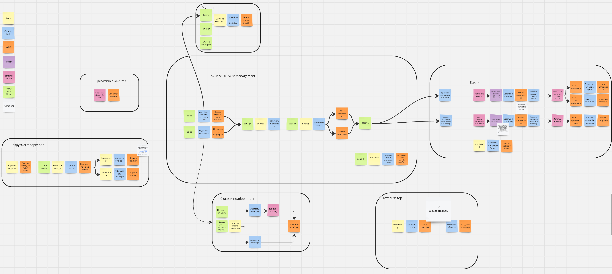
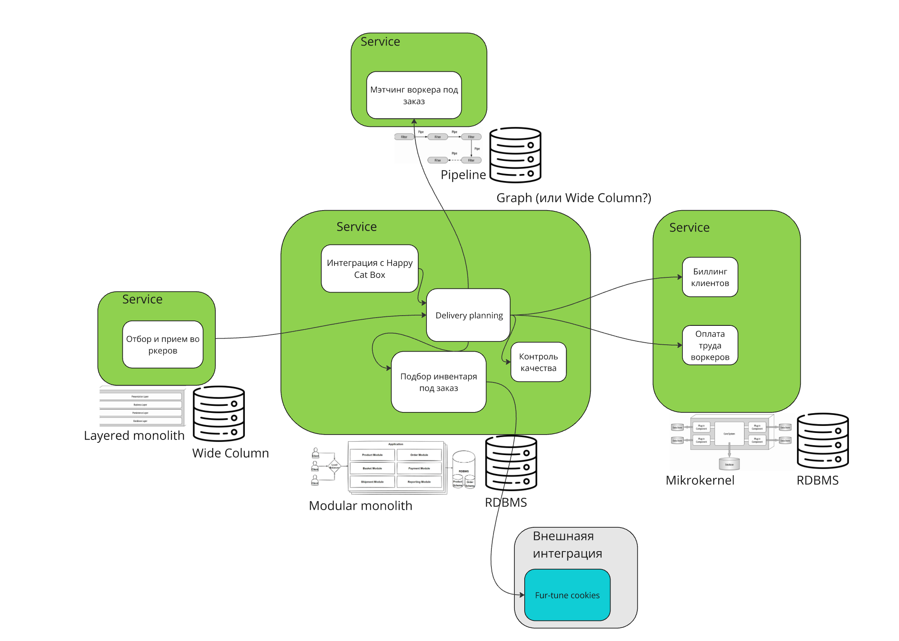

# Разбираемся с уточненными требованиями и ограничениями

Новые требования: явные и растущие из консёрнов стейкхолдеров 

Новые ограничения

# Анализируем консёрны стейкхолдеров и их влияние
|     |                            |                                                                                                                                                                                                                                                                       |
| --- | -------------------------- | --------------------------------------------------------------------------------------------------------------------------------------------------------------------------------------------------------------------------------------------------------------------- |
| ID  | **Стейекхолдер   **     | **Консёрны**                                                                                                                                                                                                                                                          |
| 1   | Бухгалтеры                 | 1. Нужно быстро добавлять новые способы списания денег с клиентов. 2. Боимся потерять фин информацию                                                                                                                                                               |
| 2   | Топ Менеджеры              | 1. Подбор воркеров: уникален и сложен. Нужны быстрые итерации, возможность продавать как сервис или как продукт 2. релизный цикл для всей системы — месяц, для скоринга работников — неделя максимум. 3. минимум внешних систем (кроме печенек и Золотой Шляпы) |
| 3   | Разработчики               | 1. система надежна 2. если смомалась - легко понять что и где чинить                                                                                                                                                                                               |
| 4   | Клиенты: коты-тестировщики | 1. работает без сбоев и не тупит                                                                                                                                                                                                                                      |
| 5   | Менеджеры                  | 1. никто не знает о системе ставок.                                                                                                                                                                                                                                   |
| 6   | Админы                     | 1. без авралов 2. простота мониторинга                                                                                                                                                                                                                             |
| 7   | Юристы                     | 1. не нарушаем законы                                                                                                                                                                                                                                                 |

> Мне кажется забыли несколько важных стейкхолдеров, которые могли бы заметно повлиять на дельнейшие решения:
> - Инвесторы и владельцы
> - Придумщики уникальной системы мэтчинга
> - Коты воркеры
> - Маркетологи
> - Работники склада
> 

# Пересматриваем Event Sourcing и Доменную модель
(на пересмотр модели данных сил не хватило)

Исходя из консёрна менеджеров, разработчики не будут делать систему ставок, потому что никто не знает о ней. 
Выношу этот контекст за рамки решения, которе мы будем автоматизировать. 

Если картинки мелковаты - вот [ссылка](https://miro.com/app/board/uXjVLrl1Qg0=/?share_link_id=382321413844) на miro

Обновленное представление доменной модели

# Выбираем архитектурный стиль

## Определяем характеристики элементов проекта

Кроме общих для проекта характеристик продиктованных ТТМ = 1 мес, у нас есть уникальные характеристики для некоторых
баунд-контекстов:
1. Мэтчинг воркера: модульность и расширяемость (более того, есть требование к map/reduce-like-архитектуре)
2. Отбор и прием воркеров: часта релизов = 1 неделя, плюс требования по reliability, потому что подвержен риску DDoS 
3. Контексты биллига и оплаты труда: требования к консистентности + у контекста биллига есть требования к модульности 
и расширяемости (частое добавление новых методов чарджинга клинетов)

Опять же [ссылка](https://miro.com/app/board/uXjVLrl1Qg0=/?share_link_id=965353980801) на миро, если мелковато...

## Выделяем сервисы

Причины по которым я выделил сервисы:
1. Метчинг воркеров: уникальность и требования к map/reduse-like архитектуре
2. Контексты биллинга и оплаты труда: имеют общие требования к костистентсности, но разные требования к модульности 
и расширяемости. Однако, они будут у этих контекстов общая рид-модель, поэтому их разделение приведет к более
сложным коммуникациям. Поэтому принял решение объединить их в одном сервисе. 
3. Контекст Отбор и прием воркеров: имеет высокую сложноть и частые релизы, плюс подвержен риску DDoS. Поэтому имеет
смысл выделить в отдельный сервис. 
4. Остальные контексты принял решение объединить в одном сервисе. 

## Фиксируем Архитектурный стиль
Общие требования agility, deployability и testability привели меня к выбору между **Сервисным и Микро-сервисным** стилями 
архитектуры. При этом, контексты связанные с биллингом выделяются особыми требованиями к консистентноси и гарантии
сохранности данных - это аргумент в пользу использования отдельного хранилища данных для них. Распространять 
строгие требования по консистентности и надежности на остальные сервисы, которые к тому же имеют различные требования
по производительности и масштабированию - неразумно. Поэтом общий стиль - **микросервисный**.

1. Сервис мэтчинга воркеров: **Pipeline-архитектура** (следует из требований и консернов стейкхолдеров)
2. Для объединенного сервисоа биллинга и оплаты труда: **Micro kernel**, т.к. есть потребность в быстром добавлении новых
методов списания денег с клиентов
    > Вообще, я задумался сделать биллинг на event-sourcing модели, чтобы обеспечить иммутабельность данных, но не вывез 
3. Сервис отбора и приема воркеров: **Layered monolith**, из-за требований по частоте релиза
4. Все остальные контексты объеденины в **модульный монолит**. 

# Выбираем тип БД для сервисов

1. Сервис биллинга имеет характеристику consistency - лучше всего подходит **RDBMS**
2. Сервис Мэтчинга воркеров предполагает частые итерации и проверку гипотез - чтобы обеспечит гибкую схему и работу
с отношениями: решение - **Graph Database**
> Тут сильно не уверен, потому что опыта с Графовыми БЛ нет
3. Сервис отбора и приема воркеров: требования к reliability и availability - лучше всего подходят Wide Column или 
Key-Value, но в HRMS обычно есть необходимость в отношениях, которые проще реализовать на Wide Column - решение - **Wide Column**
4. Модульный монолит с остальными контекстами: при не очень высоких требования к производительности и масштабированию 
будет работать с **RDBMS**

# Выбираем тип коммуникации между сервисами

В проекте есть две явно синхронные коммуникации:
- Между модульным монолитом и сервисом мэтчинга, для назначения воркера и расчет цены задачи.
- Между модульным монолитом и внешним сервисом доставки печенек 

Остальные коммуникации могут быть асинхронными, поэтому выбор: **асинхронная event-driven коммуникация**.

# Валидация

1. Контроль REST-контрактов в случае синхронных коммуникаций. Готовых решения для моего стэка не знаю,
поэтому завернул бы в code-review или регулярные ревью OpenAPI-спецификаций
2. Схемы асинхронных сообщений: через Schema Registry
3. В монолитах - контроль направления зависимостей (линтер)
4. В сервисах работающих с Wide Column - запрет на использование ORM (через документированное в ADR-ограничение)
5. ...

# ADR-003: Выделение сервиса Отбора и приема воркеров

## Status: accepted

## Context:
На основе требований и консернов стейкхолдеров, сформулировал следующие характеристики для контекста отбора и приема 
воркеров:

Помимо общих для проекта характеристик (Agility, Testability, Deployability), сервис имеет уникальные:
- Maintainability и modifiability - требование к core sub-domain
- Более высокие требования к Modifiability - требование к частоте релизов = 1 неделя (в отличии от остальных 
контекстов для которых требуется частота 1 раз в месяц)
- У контекста высокая сложность (Complexity), продиктованная уникальностью процесса отбора и приема воркеров
  - Кроме того, есть планы по продаже этого сервиса как продукта или сервиса
- Reliability: контекст подвержен риску DDoS 

## Decision:

- баунд-контектс "Отбор и прием воркеров" имеет уникальные характеристики и важность для бизнеса
- с точки зрения модели данных, контекст не имеет зависимостей от других контекстов, но является источником для 
рид-моделей в других контекстах
- уникальная для проекта харатеристика Reliability, диктует выбор отдельной БД с высокой надежностью и 
производительностью: NoSQL - выбор типа БД так же уникален в рамках проекта

Основываясь на контексте и аргументах представленных выше принял решение выделить его в отдельный сервис. 

## Compliance:
Так как нет вариантов автоматической проверки реализации архитектурного стиля, то вся проверка будет делаться 
вручную посредством изучения проектной документации и code-review.
