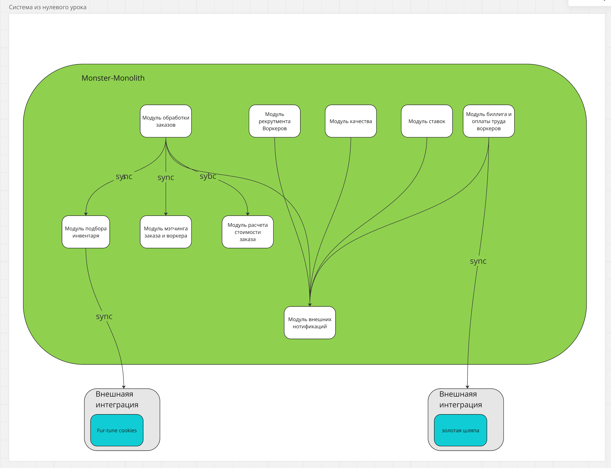

# Эволюционируем систему
Из состояния нулевого урока в целевое - 3й урок:

_Ниже будет крупнее и на всякий случай ссылка на [miro](https://miro.com/app/board/uXjVLrl1Qg0=/)_ 

## Состояние на 0 уроке:

Монстр-монолит 
> Кстати, обнаружил что есть древний фильм [The Monolith Monsters](https://en.wikipedia.org/wiki/The_Monolith_Monsters)
> 
> 

Instability моего монстра если смотреть на решение их нулевого - 1, он имеет только 2 внешних связи.
На самом деле это не так, потому что все же есть входящая связь - импорт клиентов в систему. Таким
образом более корректная оценка будет **2/3**.

Оценка нестабильности сервисов в целевой системе:

## Изменения в контекстах
1. Добавляется пропущенная внешняя интеграция по импорту клиентов
2. пропадает контекст "Нотификаций"
3. Следующие модули мостра-монолита выделяются как сервисы:
   1. Модуль подбора инвентаря
   2. Модуль мэтчинга (забирает в себя модуль расчета стоимости)
   3. Модуль рекрутмента воркеров
   4. Модуль ставок
4. модуль биллина и оплаты труда воркеров выделяется как два сервиса:
   1. Сервис биллинга клиентов
   2. Сервис оплаты труда воркеров
5. Оставшиеся два контекста Delivery Planning и контроль качества объединяются в сервис

Все эти изменения будут сопровождаться разделением единой базы данных монолита не несколько баз данных 
для каждого сервиса.

## Планируем распил монолита

Поскольку мы пилим монстр-монолит и нам предстоит создавать новые БД и менять модели данных - нам предстоит часто 
применять CDC-паттрн расписла.

### Сценарий 1: свободных людей и ресурсов нет, а опыт и (или) инфраструктура есть

#### 1. Добавляем пропущенную интеграцию по импорту клиентов 

#### 2. Начнем распил с выделения наиболее ценных для бизнеса core-сервисов  
- сервиса мэтчинга.
- сервиса рекрутмента воркеров.

Кроме того, оба сервиса имеют отличия по характеристикам. 
Оба сервиса меняют вид БД (векторная для мэтчинга и wide-column для рекрутмента) и имеют свои модели данных, поэтому
будем использовать CDC-паттерн.

#### 3. На втором этапе выделяем два финансовых сервиса
Начнем с более важного (который контролирует доходы) - сервиса биллинга клиентов.
Полле него выделяем сервис оплаты труда воркеров.

Оба сервиса наследуют тип RDBMS от монолита, но имеют свои модели данных, поэтому будем также использовать CDC-паттерн.

#### 4. На третьем этапе выделяем сервис подбора инвентаря
Сервис подбора инвентаря имеет свою модель данных и тип БД, поэтому также используем CDC-паттерн.

#### 5. Выносим оставшиеся сервисы и депрекейтим монолит
1. Сервис управления delivery (в который так же в виде модуля переедет контекст Контроля качества) - используем
Strangler Fig pattern, т.к. сохраняется тип БД и мы можем унаследовать схему данных, отрезав ненужное
2. Сервис ставок - CDC-паттерн, т.к. меняется БД

### Сценарий 2: есть свободные люди и ресурсы, а опыта и (или) инфраструктуры нет

#### 1.Добавляем пропущенную интеграцию по импорту клиентов

#### 2. Начнем распил с выноса наименее рискованной части монолита - сервиса ставок
Используем CDC-паттерн, т.к. меняется БД

#### 3. Выносим сервис подбора инвентаря
У сервиса есть внешняя зависимость, но она синхронна и уже существует в монолите.
Используем CDC-паттерн, т.к. меняется БД

#### 4. Выносим сервис биллинга клиентов
Имеет высокую важность требования по консистентности и однонаправленную коммуникацию
Используем CDC-паттерн, т.к. меняется модель данных

#### 5. Выносим сервис оплаты труда воркеров
У сервиса внешняя зависимость и требования по консистентности 
Используем CDC-паттерн, т.к. меняется модель данных

#### 6. Выносим сервис мэтчинга
Он у него 2 разнонаправленных связи, но одна из них синхронная
Используем CDC-паттерн, т.к. меняется БД

#### 7. Выносим объединенный сервис управления delivery и контроля качества
Используем Strangler Fig pattern, т.к. сохраняется тип БД и мы можем унаследовать схему данных, отрезав ненужное

#### 8. Выносим сервис рекрутмента воркеров и депрекейтим монолит
Используем CDC-паттерн, т.к. меняется БД
